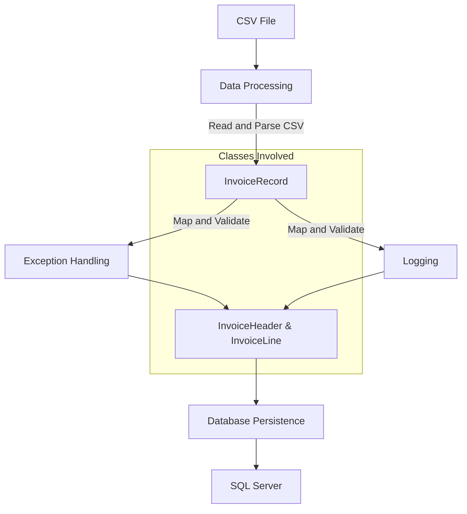
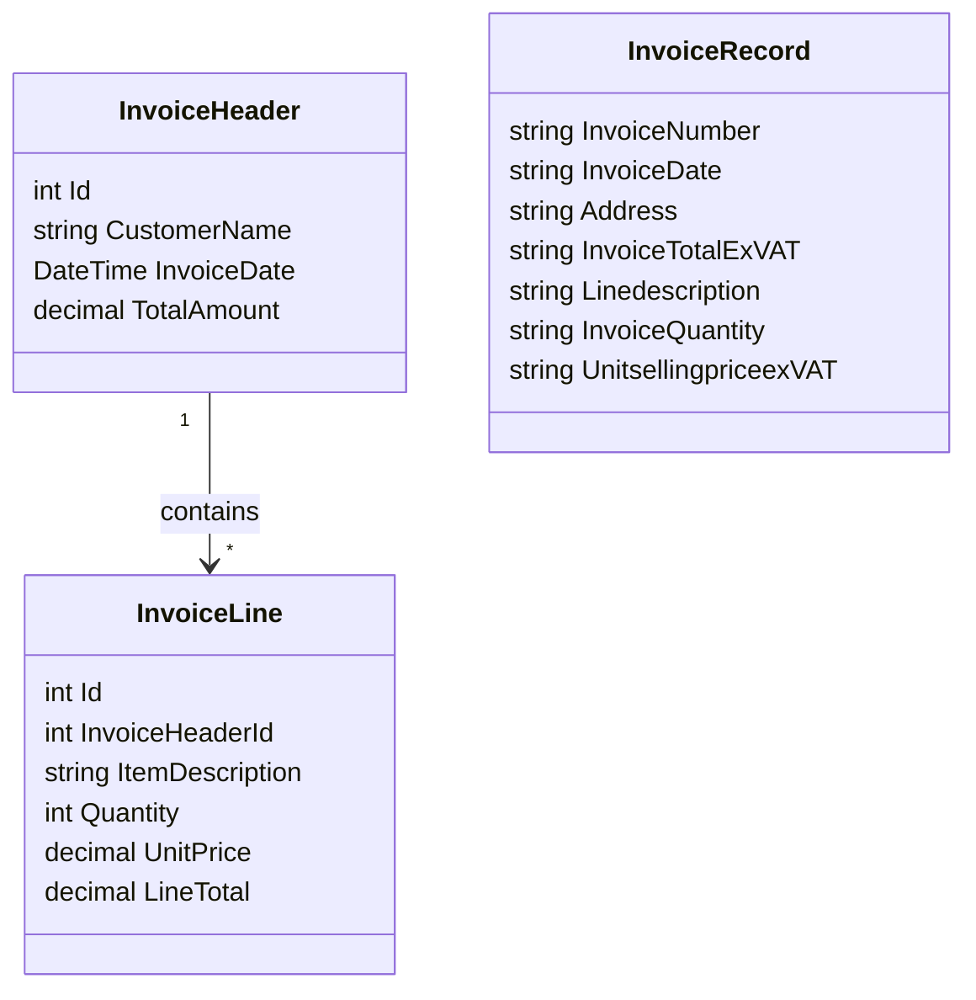

# Extract data from spreedsheet to db

This project aims to create a C# console application that imports data from a CSV file into a Microsoft SQL Server database. The database consists of `InvoiceHeader` and `InvoiceLines` tables. This README provides the steps to set up the SQL Server environment using Docker and explains the process of reading data from the spreadsheet and updating the database.

## Docker Commands

1. Pull the SQL Server Docker image:
    ```bash
    docker pull mcr.microsoft.com/mssql/server
    ```

2. Run the SQL Server container:
    ```bash
    docker run -e "ACCEPT_EULA=Y" -e "MSSQL_SA_PASSWORD=yourStrong()Password" \
       -e "MSSQL_PID=Developer" \
       -p 1433:1433 --name invoiceserver --hostname invoiceserver \
       -d \
       mcr.microsoft.com/mssql/server:2022-latest
    ```

3. Draft Solution 
    

## Data Flow and Middleware

### Data Flow
1. **Source (CSV File)**: The user uploads a CSV file containing invoice data.
2. **Data Processing**: The CSV file is read and parsed in the application, mapping the data to the `InvoiceHeader` and `InvoiceLine` models.
3. **Exception Handling**: Any errors during the reading and parsing of the CSV file are logged. If any critical issues arise, the process halts with an appropriate error message.
4. **Logging**: All significant actions and errors during the process are logged for auditing and debugging purposes.
5. **Database Persistence**: The processed and validated data is then persisted in the SQL Server database. Data is inserted into the `InvoiceHeader` and `InvoiceLines` tables via Entity Framework.

### Middlewares Used
1. **Serilog for Logging**:
    - Logs all significant actions and errors to both the console and a file.
    - Example log actions include starting the application, reading CSV, database operations, and shutting down the application.

2. **Error Handling Middleware**:
    - Handles exceptions globally within the application.
    - Ensures that any errors during CSV processing or database operations are caught, logged, and appropriate error messages are displayed.

3. **Entity Framework Middleware**:
    - Handles database connections and operations.
    - Ensures that the data is inserted or updated transactionally to maintain data integrity.


## User Flow Diagram

To understand the data flow better, refer to the following diagram:




## Class Diagrams

To visualize the class diagrams, you need to have Markdown with Mermaid support. If your Markdown viewer does not support Mermaid diagrams, consider using a plugin or a viewer that supports it (e.g., GitHub, GitLab, Visual Studio Code with the Mermaid plugin).


