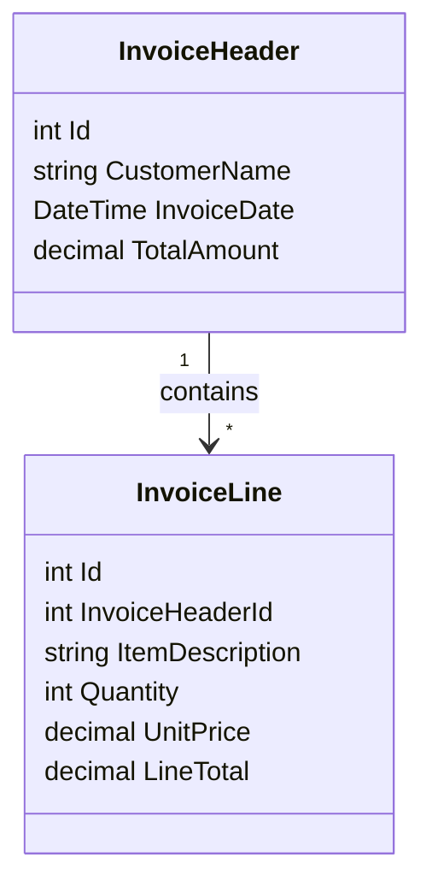

# Extract data from spreedsheet to db

This project aims to create a C# console application that imports data from a CSV file into a Microsoft SQL Server database. The database consists of `InvoiceHeader` and `InvoiceLines` tables. This README provides the steps to set up the SQL Server environment using Docker and explains the process of reading data from the spreadsheet and updating the database.

## Docker Commands

1. Pull the SQL Server Docker image:
    ```bash
    docker pull mcr.microsoft.com/mssql/server
    ```

2. Run the SQL Server container:
    ```bash
    docker run -e "ACCEPT_EULA=Y" -e "MSSQL_SA_PASSWORD=yourStrong()Password" \
       -e "MSSQL_PID=Developer" \
       -p 1433:1433 --name invoiceserver --hostname invoiceserver \
       -d \
       mcr.microsoft.com/mssql/server:2022-latest
    ```

3. Draft Solution 
    


## Class Diagrams


